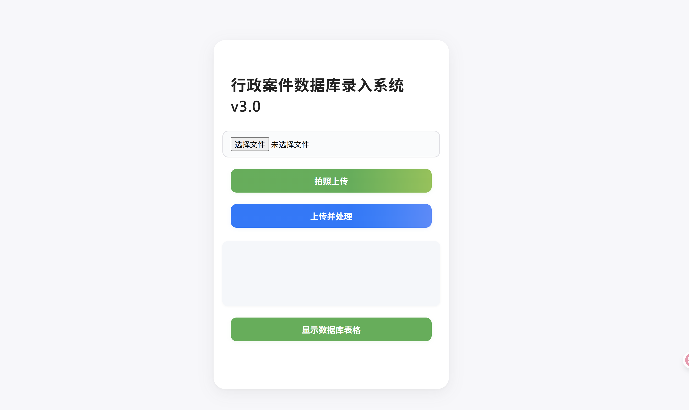

# 行政案件数据库录入系统v3.0

## 项目简介
本项目基于Flask实现Web应用，支持多文件（PDF、Word、TXT等）上传，自动调用本地Dify工作流进行智能解析与结构化信息抽取，读取和展示dify工作流写入pgsql数据库中的表格，提供下载为excle文件功能，适用于合同、诉讼案件等文档的批量处理与数据库录入和展示。



## 主要功能
- 支持多种文件格式（PDF、Word、TXT、图片等）批量上传
- 自动对接本地Dify工作流，智能解析文件内容
- 结构化提取案件、合同等关键信息
- 读取和展示dify工作流写入pgsql数据库中的表格，提供下载为excle文件功能
- **流式SSE体验**：Dify工作流结果实时流式推送，前端边处理边展示，极致交互体验
- **现代苹果风前端**：简洁大方、圆角卡片、蓝色渐变按钮、响应式设计
- **弹窗表格展示**：上传结果下方有“显示数据库表格”按钮，点击后以弹窗（Modal）方式展示数据库表格，表格宽度自适应，支持横向滚动，表头完整可见。
- **布局优化**：上传结果（result）文本框与按钮宽度一致，按钮下方有充足留白，整体界面均衡美观。

### 数据库表格展示功能说明

本系统支持通过前端页面的“显示数据库表格”按钮，实时查询并弹窗展示本地PostgreSQL数据库中指定表的数据。用户点击按钮后，系统会自动从数据库读取最新的结构化数据（默认最多100条），并以弹窗表格的形式在页面中直观展示。表格支持宽度自适应、横向滚动、内容截断与弹窗查看等交互体验，便于用户核查Dify智能解析结果是否已成功写入数据库。该功能仅用于前端数据可视化和结果核查，提升了系统的易用性和透明度。


## 安装与运行
1. 安装依赖：
   ```bash
   pip install -r requirements.txt
   ```
2. 启动Flask服务：
   ```bash
   python app.py
   ```
3. 访问前端页面：
   浏览器打开 http://localhost:8888

## API说明
- `POST /upload`
  - 参数：
    - `input_data`：多文件上传字段，支持PDF、Word、TXT等
  - 返回：Dify工作流结构化处理结果（SSE流式，event-stream）

## 前后端流式交互与UI说明
- 前端页面支持多文件选择与上传，上传后自动通过SSE流式展示Dify返回的结构化结果。
- 仅展示最终workflow_finished事件的task_id、status和output三项内容，避免中间过程干扰。
- 文件字段名需与Dify工作流Start节点变量名一致（本项目为`input_data`）。
- 前端采用现代苹果风格UI，极简美观。
- 上传结果区域（result文本框）宽度与按钮一致，向上靠近表单，最小高度增大，便于查看内容。
- “显示数据库表格”按钮位于result下方，点击后弹出大宽度Modal，表格内容完整、可滚动。
- 按钮下方有充足留白，整体布局更均衡。

## Dify对接说明
- 本地Dify服务API地址：`http://localhost/v1`
- 工作流ID：`××××××××`
- API Key：`app-×××××××`
- Flask后端通过`/v1/workflows/run`接口与Dify对接，采用`multipart/form-data`格式上传文件，workflow调用为SSE流式（streaming模式）。
- 需保证Dify工作流Start节点变量名为`input_data`，类型为`file-list`。

### 系统核心数据流说明

本系统实现了从文件上传、智能解析到结构化数据入库与可视化展示的全流程自动化。具体流程如下：

1. **文件上传**  
   用户通过前端页面选择并上传多个文件（支持PDF、Word、TXT等格式）。

2. **Dify智能解析**  
   后端接收到文件后，自动调用本地Dify工作流API，将文件传递给Dify进行智能解析与结构化信息抽取。

3. **后端接收结构化结果**  
   Dify工作流以流式（SSE）方式返回结构化处理结果，后端实时接收并解析最终输出。

4. **写入本地PostgreSQL数据库**  
   后端将Dify返回的结构化数据自动写入本地pgsql数据库，确保数据持久化和后续可查询。

5. **前端调用数据库并展示**  
   用户可通过前端“显示数据库表格”按钮，实时查询本地pgsql数据库中的结构化数据，并以弹窗表格形式直观展示，支持内容截断、弹窗查看与一键复制等交互体验。

该流程实现了文档的自动化解析、结构化入库与可视化核查，极大提升了数据处理效率和用户体验。

## 一键启动说明

1. 确保已安装Python 3.7及以上版本。
2. 直接双击项目根目录下的 `start.bat` 脚本：
   - 自动创建虚拟环境（venv）
   - 自动安装所有依赖
   - 自动启动Flask服务
3. 浏览器访问 http://localhost:8888

无需手动pip安装，所有依赖和静态资源均已本地化，适合新手一键部署。

## 目录结构
```
├── app.py           # Flask主程序
├── requirements.txt # 依赖
├── README.md        # 项目说明
├── templates/
│   └── index.html   # 前端页面（苹果风美化+流式体验+弹窗表格+布局优化）
└── static/
    └── style.css    # 样式（可选）
```

## 参考
- [Dify官方文档](https://docs.dify.ai/)
- [Dify工作流文件上传说明](https://docs.dify.ai/guides/workflow/file-upload) 
